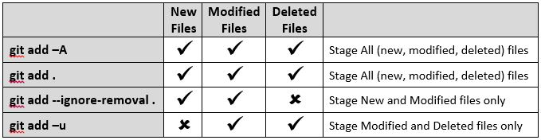

# git


…or create a new repository on the command line
```
echo "# test" >> README.md
git init
git add README.md
git commit -m "first commit"
git remote add origin git@github.com:account/test.git
git push -u origin master
```
…or push an existing repository from the command line
```
git remote add origin git@github.com:account/test.git
git push -u origin master
```




+git add -A is equivalent to git add --all
+git add -u is equivalent to git add --update
